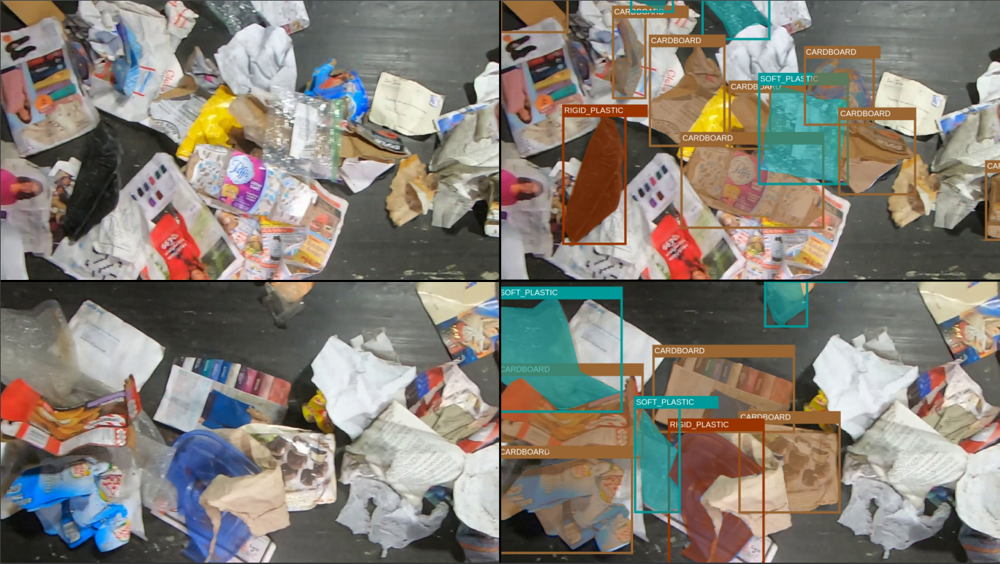

# ZeroWaste: Towards Automated Waste Recycling


This is the official repository of the ZeroWaste project [arxiv](http://a.com). Our ZeroWaste dataset distributed under 
<a rel="license" href="http://creativecommons.org/licenses/by-nc/4.0/"></a><br /><a rel="license" href="http://creativecommons.org/licenses/by-nc/4.0/">Creative Commons Attribution-NonCommercial 4.0 International License </a>  can be found [here](http://csr.bu.edu/ftp/recycle/).

## Supervised experiments
### Requirements
* pytorch 1.8
* [Detectron2](https://github.com/facebookresearch/detectron2) (please see the [official installation guide](https://detectron2.readthedocs.io/en/latest/tutorials/install.html))

### Training
To train the supervised methods (DeeplabV3+ or Mask R-CNN), use the command below: 
```
# train deeplab on ZeroWaste data
python deeplab/train_net.py --config-file deeplab/configs/zerowaste_config.yaml --dataroot /path/to/zerowaste/data/ (optional) --resume OUTPUT_DIR /deeplab/outputs/*experiment_name* (optional) --MODEL.WEIGHTS /path/to/checkpoint.pth

# train Mask R-CNN on ZeroWaste\TACO-zerowaste data
python maskrcnn/train_net.py --config-file maskrcnn/configs/*config*.yaml (optional, only use if trained on TACO-zerowaste) --taco --dataroot /path/to/zerowaste/data/ (optional) --resume OUTPUT_DIR /maskrcnn/outputs/*experiment_name* (optional) --MODEL.WEIGHTS /path/to/checkpoint.pth
```

### Evaluation
The checkpoints for the experiments reported in our paper can be found [here](http://csr.bu.edu/ftp/recycle/models/). Please use the following code to evaluate the model on our dataset:
```
# evaluate the pretrained deeplab ZeroWaste:
python deeplab/train_net.py --config-file deeplab/configs/zerowaste_config.yaml --dataroot /path/to/zerowaste-or-taco/data/  --eval-only OUTPUT_DIR /deeplab/outputs/results/ --MODEL.WEIGHTS path/to/checkpoint.pth

# evaluate the pretrained Mask R-CNN on ZeroWaste\TACO-zerowaste:
python deeplab/train_net.py --config-file deeplab/configs/*config*.yaml (optional, only use if evaluated on TACO-zerowaste) --taco --dataroot /path/to/zerowaste-or-taco/data/  --eval-only OUTPUT_DIR /maskrcnn/outputs/*experiment_name*/ --MODEL.WEIGHTS path/to/checkpoint.pth
```

## Semi-supervised experiments
We used the [official implementation](https://github.com/yassouali/CCT) of [CCT](https://arxiv.org/pdf/2003.09005.pdf)  with minor modification in data loading for our experiments. 

### Requirements
* Python 3.7
* pytorch >= 1.1.0
* torchvision, PIL, OpenCV

### Data
Please download and unzip the ZeroWaste-f and ZeroWaste-s for the semi-zupervised experiments. Then, the experiment config (e.g. configs/zerowaste_config.json) should be edited so that fields ```data_dir``` include the correct path to the corresponding dataset split. 

### Training
To train the model from scratch with the hyperparameters used in our experiments, please download the initial checkpoint [here](https://github.com/yassouali/CCT/releases/download/v0.1/3x3resnet50-imagenet.pth) and put it to ```cct/models/backbones/pretrained/``` and use the following command:

```
python train_zerowaste.py -c configs/zerowaste_config.json
```
This command works for the semi-supervised setup, for the supervised experiment use ```configs/zerowaste_config_sup.json``` instead. 

### Evaluation
The trained model checkpoints can be found [here](http://csr.bu.edu/ftp/recycle/models/cct/). The following command runs inference on the given data: 

```
python zerowaste_inference.py --config config.json --model best_model.pth --images path/to/images/
```

## Citation
Please cite our paper: 
```
@article{zerowaste,
  author =       {Dina Bashkirova, Ziliang Zhu, James Akl,    Fadi Alladkani, Ping Hu, Vitaly Ablavsky, Berk Calli, Sarah Adel Bargal and Kate Saenko},
  title =        {ZeroWaste dataset: Towards Automated Waste Recycling},
  howpublished = {arXiv preprint},
  year =         {2021}
}
```

